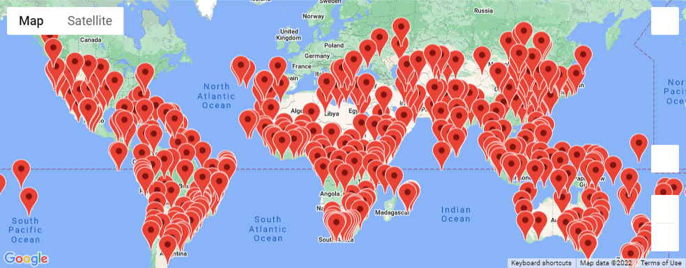

# World_Weather_Analysis
## Purpose
The purpose of this project is to generate a random list of longitudes and latitudes and use apis to locate them and provide information on each city. And then select four of the data points and create a travel itinerary for the cities. The information included:
- City Name
- Country 
- Max Temperature
- Weather Description 
- The name of a hotel within a certain distance from the longitude and latitude that was generated. 

## Results
We were able to generate a map with each loaction of the cities marked with a label.  

After selecting four points on the map, we used Google's Directions API to create a route to travel between the four cities.

Next we created labels for the four cities, showing the current weather information and a hotel name. 

